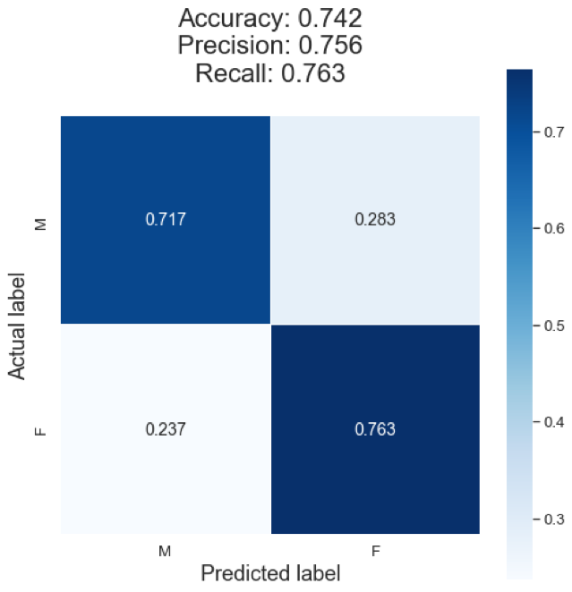
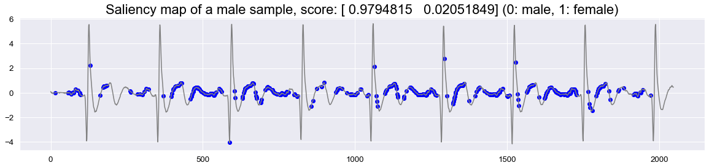
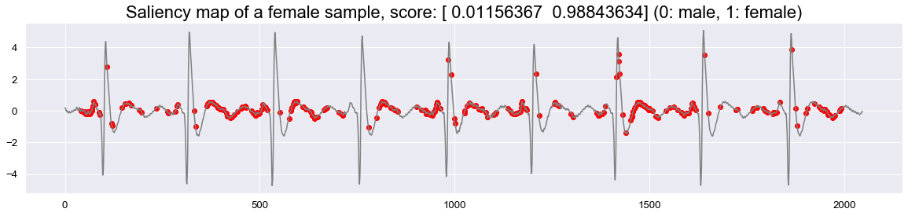

# Classifying the gender of a patient by their ECG signal

This repository contains the code to train a convolutional neural network to classify the gender of a patient from their ECG signal

## Usage

Clone the repository and install the project and its dependencies. 
Numpy needs to be installed first because it is required by pyedflib.

    git clone https://gitlab.abla.cloud/ecg-gender-classification.git
    pip install numpy
    pip install -r requirements.txt

### Data

You need to apply for the following datasets ([SHHS](https://sleepdata.org/datasets/shhs), [MESA](https://sleepdata.org/datasets/mesa)), download them and convert them to .npy files using 

    data/convert_data.py

- For the SHHS dataset, only the follow-up clinic visit (SHHS2) has the right
sampling rate. Navigate to shhs/files/polysomnography/edfs/shhs2 to get those files. 
- The MESA the files can be found at mesa/files/polysomnography/edfs
- In addition, you need to download the following files which include the 
meta-data: [SHHS-Meta](https://sleepdata.org/datasets/shhs/files/datasets/shhs2-dataset-0.14.0.csv) 
[MESA-Meta](https://sleepdata.org/datasets/mesa/files/datasets/mesa-sleep-dataset-0.3.0.csv)

Before running the convert_data.py, make sure to adapt the paths in the
config section accordingly.

### Training

Adapt the config section in train.py and run the script

    python3 train.py

## Results

We report a 74% accuracy on the test set.

 

## Evaluation

Evaluation of the trained model is done in the jupyter notebook eval.ipynb.

 
 

Saliency maps show which part of the input contributes the most to the
decision made by the network. The two maps show input where high saliency
scores are marked by red and blue dots.

## Further work

The limitations of this project are mainly due to the data available.
Further work could include using data from more patients and with
more ECG-channels. It would also be interesting to predict medically
more useful features than the gender of a patient.
    